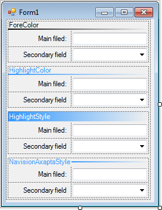
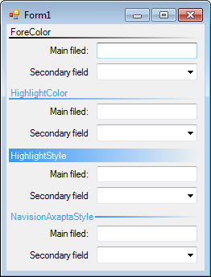
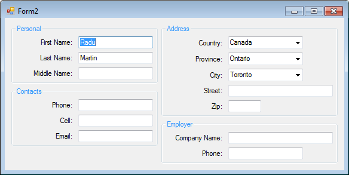

## Problem

There are a lot of panels for grouping the controls in WinForms. The best one of them is _TableLayoutPanel_, especially for grouping controls, that are using for editing data. Unfortunately, this panel does not show the header. This necessity appears when there are different kinds of editing controls on the same Windows form.

## Solution

It can be solved by _GroupBox_ and _TableLayoutPanel_. This solution is easy, but may look unpleasant. Another possibility is using _Label_ control in first row of _TableLayoutPanel_. This solution may be uncomfortable.

I prefer to make inherited panel from _TableLayoutPanel_ with all necessary functions.

## How It Works

TableLayoutPanel with highlighted header called _HeaderTableLayoutPanel_ is simple, useful, and cute. This control may show a header in different ways:

The _HeaderTableLayoutPanel_ implements just three properties:
- _CaptionText_ - string property that contains a text for showing. If this property is _string.Empty_ or _null_ then the header will not be shown
- _CaptionStyle_ - this is enum (_HighlightCaptionStyle_) property that points a drawing style. It can be: _ForeColor_, _HighlightColor_, _HighlightStyle_, _NavisionAxaptaStyle_, _GroupBoxStyle_ (see the image above)
- _CaptionLineWidth_ - byte property that points the width of header's line (nothing effect, if _CaptionStyle = HighlightCaptionStyle.GroupBoxStyle_)

Be aware of _CaptionLineWidth_. If _CaptionStyle = HighlightCaptionStyle.HighlightStyle_, then two lines with width=_CaptionLineWidth_ will be shown, one will be above the Header and the second one will be below the header. For _CaptionStyle = HighlightCaptionStyle.GroupBoxStyle_ this property does not do anything. 

### Screens

## License
 This work is licensed under a <a rel="license" href="http://creativecommons.org/licenses/by-nc-sa/4.0/">Creative Commons Attribution-NonCommercial-ShareAlike 4.0 International License</a>.
